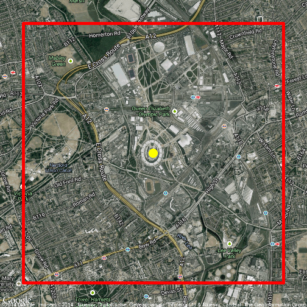

# bounding_box Function
## Tyler Rinker
### June 02, 2014

This is an R implementation of Jan Philip Matuschek's [bounding box article](http://janmatuschek.de/LatitudeLongitudeBoundingCoordinates) *Finding Points Within a Distance of a Latitude/Longitude Using Bounding Coordinates*.


```r
#' Calculate Bounding Box
#' 
#' Caclulate a bounding box for a center point given a set of coordinates.
#' 
#' @param lat The latitude of the center point.
#' @param lon The longitude of the center point.
#' @param dist The distance from the center point.  
#' @param in.miles logical.  If \code{TRUE} uses miles as the units of \code{dist}.  If \code{FALSE} uses kilometers.
#' @return Returns a matrix with max/min latitude/longitude values.
#' @references \url{http://janmatuschek.de/LatitudeLongitudeBoundingCoordinates}
#' @keywords bounding_box, coordinates
#' @export
#' @examples
#' bounding_box(38.8977, 77.0366, 1)
bounding_box <- function(lat, lon, dist, in.miles = TRUE) {

    ## Helper functions
    if (in.miles) {
        ang_rad <- function(miles) miles/3958.756
    } else {
        ang_rad <- function(miles) miles/1000
    }
    `%+/-%` <- function(x, margin){x + c(-1, +1)*margin}
    deg2rad <- function(x) x/(180/pi)
    rad2deg <- function(x) x*(180/pi)
    lat_range <- function(latr, r) rad2deg(latr %+/-% r)
    lon_range <- function(lonr, dlon) rad2deg(lonr %+/-% dlon)
       
    r <- ang_rad(dist)
    latr <- deg2rad(lat)
    lonr <- deg2rad(lon)
    dlon <- asin(sin(r)/cos(latr))

    m <- matrix(c(lon_range(lonr = lonr, dlon = dlon), 
        lat_range(latr=latr, r=r)), nrow=2, byrow = TRUE)

    dimnames(m) <- list(c("lng", "lat"), c("min", "max"))
    m
}
```

So here we can look at the area within one square mile of the White House:


```r
bounding_box(38.89768, -77.03653, 1)
```

```
##        min    max
## lng -77.06 -77.02
## lat  38.88  38.91
```

Let's apply it.  Here's an example plotting a bounding box around the 2012 Olympic Stadium:


```r
library(ggplot2); library(ggmap)

bb <- bounding_box(lon = -0.016179, lat = 51.538525, 1)

mapImageData <- get_map(location = c(lon = -0.016179, lat = 51.538525),
    color = "color",
    source = "google",
    maptype = "hybrid",
    zoom = 14)
 
ggmap(mapImageData,
    extent = "device",
    ylab = "Latitude",
    xlab = "Longitude") + 
	geom_rect(aes(xmin = bb[1, 1], xmax = bb[1, 2], ymin = bb[2, 1], 
 		ymax = bb[2, 2]), color="red", fill=NA, size=2) 
```

 


